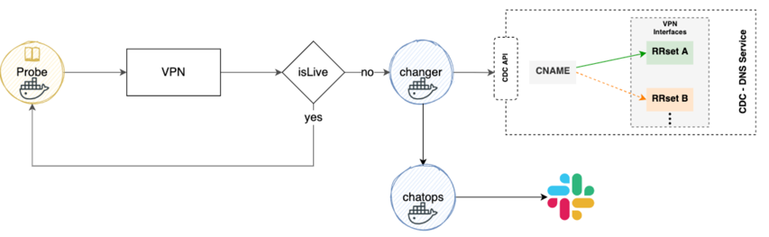
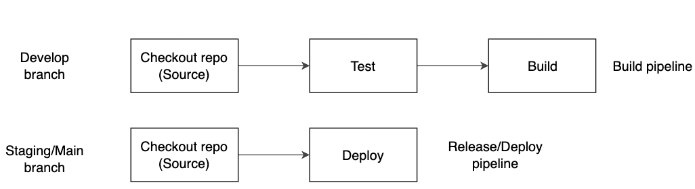

# Ciclope-Changer

> Ciclope is an initiative of Mercado Libre infrastructure team composed of an ecosystem of microservices that together provide a software mechanism capable of switching network traffic from the main VPN to an alternative VPN.
> Cyclops Changer is a webhook responsible for receiving a request and sending a DNS record change request to the CDC service.

## Flow

## Develop Guide
The most important premise of this project is to be a continuous beta, so your contribution is very welcome.

1. Branch Strategy

2. CI/CD Process

## Contributions

To contribute and report problems is very easy, just follow this [Doc](https://github.com/moquintanilha/ciclope-changer/blob/main/docs/contribution/README.md)

## License

© 2021 Mercado Libre
