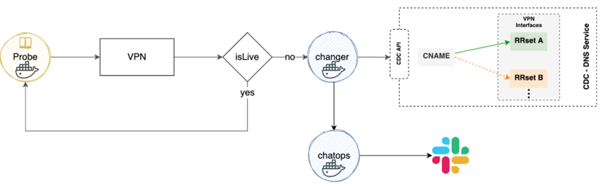
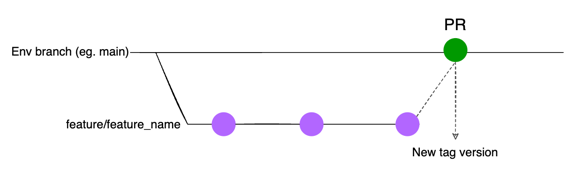
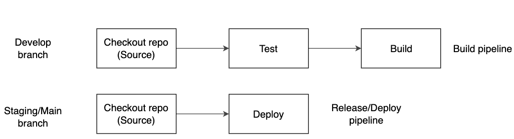

Ciclope-Changer
###############

.. image:: https://github.com/moquintanilha/ciclope-changer/workflows/CI/badge.svg
    :target: https://github.com/moquintanilha/ciclope-changer/actions?workflow=CI

Ciclope is an initiative of Mercado Libre infrastructure team composed of an ecosystem of microservices that together provide a software mechanism capable of switching network traffic from the main VPN to an alternative VPN.
Cyclops Changer is a webhook responsible for receiving a request and sending a DNS record change request to the CDC service.

Flow
****

Develop Guide
*************
The most important premise of this project is to be a continuous beta, so your contribution is very welcome.

1. Branch Strategy
==================

In our project we chose to use the Gitlab **Flow strategy**, with a change in the name of the pre-production (staging) and production (main) branches.
It is worth remembering that this model is not written in stone, and suggestions are welcome.

2. CI/CD Process
================

3. Local Test
=============

If you want to test this project locally, follow these steps:

3.1 Build image
===============

.. code-block:: python
docker build -t ciclope-changer:demo .

3.2 Launch container
====================

.. code-block:: python
docker run -p 80:8080 ciclope-changer:demo

.. note::

To test, just use this in your browser: http://localhost/health-check or http://localhost/docs

Contributions
=============

To contribute and report problems is very easy, just follow this [Doc](docs/contribution/README.md)

License
=======

© 2021 Mercado Libre
